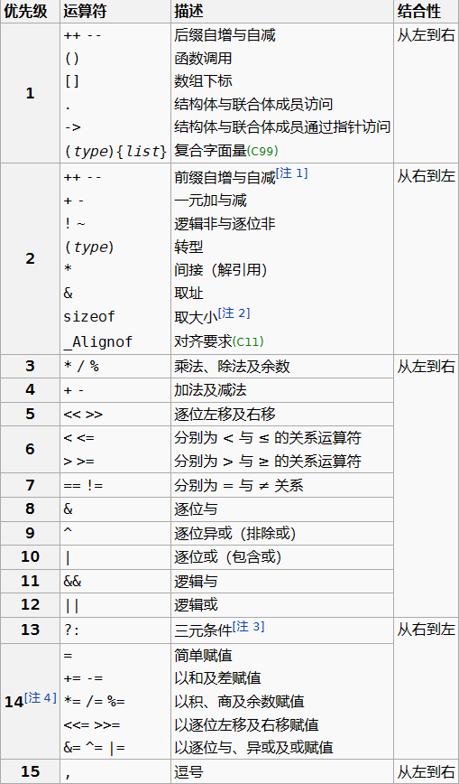

## 2.2计算机中的数据存储

- 1
计算机存储数据的基本单位：字节
计算机表示数据的基本单位：位
1字节 = 8bit
表示数据方式：二进制
整型数据占4字节 = 32bit

| 0x0fd9a0 | 0x0fd9a1 | 0x0fd9a2 | 0x0fd9a3 |
| :------: | :------: | :------: | :------: |
| 01001101 | 01001101 | 01001101 | 01001101 |

- 2
一个整型数占4字节(4个8bit)，地址是连续存取的
每一个字节(8bit)有一个十六进制的地址
4GB内存是有4GB个地址所以计算机才能识别4GB个字节

-3
图像：一个有8个位置的小格子，每个格子连续存储，格子头顶有地址号
一个内存地址对应一个字节
内存中有一块空间来存放地址信息

## 2.3 整形int与补码表示

整型：int | 格式占位符：%d
⼤小：4字节，32位
范围：-2^31^(-2147483648)~ 2^31^-1(2147483647)
<br/>
计算机中表现负数-补码表示法(源码取反+1)
为什么：因为比如一个4bit 0000 ，最左边0表示正数后三位来表示8进制的话最大到7，7-2相当于7+(-2)[0111+1110];**溢出循环**
补码的好处把减法变成加法
第一位为0为正，第一位为1为负

## 2.4 常用的数据类型与ASCII编码规则

长整型：long long | 格式占位符：%lld
⼤小：8字节，64位
范围：-2^63^ ~ 2^63^-1
<br/>
单精度浮点型：float | 格式占位符：%f
⼤小：4字节，32位
有效数字：7位(从第一位不为0的数开始算起)保证前7位正确，后面愿意信就信
<br/>
双精度浮点型：double | 格式占位符：%lf
⼤小：8字节，64位
有效数字：15位；保证前15位正确，后面愿意信就信
<br/>
字符型：char | 格式占位符：%c
⼤小：1字节，8位
编码⽅式：ASCII编码

字符《对应》数字   --》编码规则

2^8^ = 256,,256个字节可以对应256个字符
**A--65--0100,0001**
**a--97--0110,0001**
**0--48--0011,0000**
<br/>


## 2.6 输入&输出函数

- printf 函数
    - 头文件：stdio.h
    - 原型：int printf(const char *format, ...);
    - format：格式控制**字符串**
    - ...：可变参数列表
    - 返回值：<mark>输出字符的数量</mark>
    
<br/>

- scanf 函数
    - 头文件：stdio.h
    - 原型：int scanf(const char *format, ...);
    - format：格式控制**字符串**
    - ...：可变参数列表
    - 返回值：<mark>成功读入的参数个数</mark>
    - 工作原理：从终端读入数据；**会以空格这种空白符号作为截断符号的；从第一个非空白符开始直到第一个空白符截断**
    - getchar()：可以用来吞掉空格
    
- scanf 和 printf 的兄弟函数
    - sscanf 函数
        - 原型：int sscanf( const char          \*buffer, const char \*format, ... );
        - 工作原理：**从buffer(字符串)中读入数据传给...(可变参数列表)，不是从终端读入数据给变量了**；<mark>将字符串信息转换成其他类型的信息</mark>
    - sprintf 函数
        - 原型：int sprintf( char          \*buffer, const char \*format, ... );
        - 工作原理：**是将...中的数据通过格式化字符串format，输除到buffer字符串中，不会输出到终端显示**；<mark>将其他信息转换成字符串信息</mark>
    - 第一个s代表字符串

<br/>

- <mark>格式指示符</mark>：
    - %：**匹配字面%**
    - s：**匹配非空白字符的序列（一个字符串）**
    - []：**匹配 集合 中的字符的一个非空字符序列**
    
<br/>

- 字符串：一组字符构成的数据信息
    - 字符串数组 char s[n];可以存储n-1位字符加末尾的"\0"

## 2.12 基本运算符

|     运算符     |         说明          |
| :------------: | :-------------------: |
|       =        |       赋值运算符       |
| +、-、*、/、() |      基本四则运算      |
|       %        |       求余运算符       |
|  &、\|、^、~   | 位运算(非常重要的一类) |
|     <<、>>     |       左移和右移       |

- / (除法)：向0取整

- <mark>位运算(重要)</mark>：
    - &按位与：相应位置都为真才是真
    - |按位或：有真就位真
    - ^异(不同)或：1.相对位置不同输出为真，相同输出为假；2.^的应用：统计相应二进制位上1的奇偶性；3.^运算自己就是自己的逆运算；4.^运算来交换两个变量的值（是3的扩展应用）<mark>[a^=b,b^=a,a^=b]</mark>;
    - ~按位取反：1.与补码相关，负数(按位取反+1)；2.取得二进制表示最后一位1的表示：方法->-x & x
    - <<,>>：1.将二进制向左移动一位末尾补0，向右移动一位开头补符号位；2. <mark><<:相应数字\*2；>>:相应数字/2(向下取整)，，这里与/在正数运算上无差别，在负数上是有去别的</mark>
    
- 运算符优先级


- 运算符的结合性：<mark>遇到相同级别[运算符]的时候怎么计算？</mark>

## 2.15 常用数学函数
- 头文件：math.h

|      常用函数      | 常用函数  |
| :---------------: | :------: |
|     pow(a,n)      | fabs(n)  |
|      sqrt(n)      |  log(n)  |
|      ceil(n)      | log10(n) |
|     floor(n)      | acos(n)  |
| abs(n) (stdlib.h) | .......  |

1. pow-函数说明
    - pow 函数：指数函数
        - 头文件：math.h
        - 原型：double pow(double a, double b);
        - a：底数
        - b：指数
        - 返回值：返回 a^b^ 的结果
        - 例子：pow(2, 3) = 8
        
2. sqrt-函数说明
    - sqrt 函数：开平方函数
        - 头文件：math.h
        - 原型：double sqrt(double x);
        - x：被开方数
        - 返回值：返回 $\sqrt{a}$  的结果
        - 例子：sqrt(16) = 4

3. ceil-函数说明
    - ceil 函数：上取整函数
        - 头文件：math.h
        - 原型：double ceil(double x);
        - x：某个实数
        - 返回值：返回 $\lceil x \rceil$ 的结果
        - 例子：ceil(4.1) = 5
        
4. floor-函数说明
    - floor 函数：下取整函数
        - 头文件：math.h
        - 原型：double floor(double x);
        - x：某个实数
        - 返回值：返回 $\lfloor x \rfloor$的结果
        - 例子：floor(4.9) = 4 

5. abs-函数说明
    - abs 函数：整数绝对值函数
        - 头文件：stdlib.h
        - 原型：int abs(int x);
        - x：某个整数
        - 返回值：返回 $|x|$ 的结果
        - 例子：abs(-4) = 4

6. fabs-函数说明
    - fabs 函数：实数绝对值函数
        - 头文件：math.h
        - 原型：double fabs(double x);
        - x：某个实数
        - 返回值：返回$|x|$的结果
        - 例子：fabs(-4.5) = 4.5

7. log-函数说明
    - log 函数：以 e 为底对数函数
        - 头文件：math.h
        - 原型：double log(double x);
        - x：某个实数
        - 返回值：返回 log~e~x的结果
        - 例子：log(9) = 2.197225…
        
8. log10-函数说明
    - log10 函数：以 10 为底对数函数
        - 头文件：math.h
        - 原型：double log10(double x);
        - x：某个实数
        - 返回值：返回 log~10~x 的结果
        - 例子：log10(1000) = 3

9. acos-函数说明
    - acos 函数
        - 头文件：math.h
        - 原型：double acos(double x);
        - x：角度的余弦值
        - 返回值：以弧度值返回 arccos(x) 的结果
        - 例子：acos(-1) = 3.1415926…

<br/><br/><br/>

---
```
网友的笔记--开开熊
## 数据单位的存储空间

在我的16G RAM的电脑中获得的一些数据
$$sizeof(int)=4
$$
$$sizeof(int*)=8
$$
$$sizeof(double)=8, 
$$
$$sizeof(double*)=8
$$

int,double类型的存储字节和语言本身有关，而**指针类型的存储字节却和硬件有关**
*为什么*，这是因为，**指针类型数据本质上是地址**，而地址是用编号来表示的，不同的RAM，所需要的编号数量自然不同，而表示这个编号我们也需要一定的字节/位.

给内存贴上地址的好处就是可以通过**直接寻址**的手段来快速访问数据
## 地址，内存：

**电脑和手机上的重要数据存三份，本地一份，云端一份，备用硬盘一份，数据才是最重要的**
### 地址

内存最小存储单元为**字节**。一个字节占8位，对于每个最小存储单元用编号来表示(16进制)，**这个编号也就是地址**，$sizeof(int*)$实际上就是求出**本机表示地址的字节数**，这也就是为什么$sizeof(int*)$和$sizeof(double*)$相同的原因了，无论是$int*$还是$double*$都表示的是本机地址，其字节数自然相等

### 内存


上面我们讲到地址，目前我们常用的电脑有**32位电脑**和**64位电脑**，这里的*位*也就是电脑用来表示地址的位数。

32位电脑支持32位的地址也就是地址可以用$32/8=4$个字节来表示，32位电脑支持的最大内存也就是$2^{32}$位，也就是$4*2^{30}$位，即4GB

64位电脑的地址可以用$64/8=8$个字节来表示，其支持的最大内存为$2^{64}$位，也就是$4GB*4GB=16EB$
的内存，现在电脑主流都是64位CPU，16G RAM，当然可以轻松支持
```