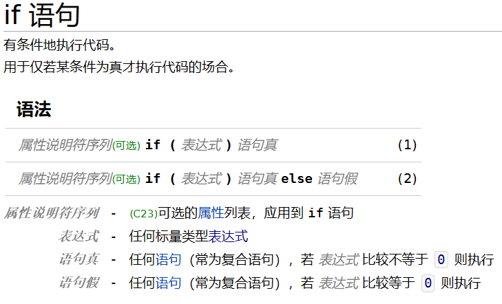
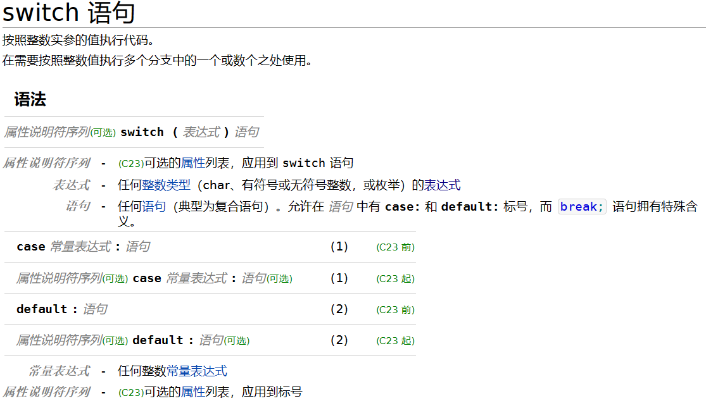
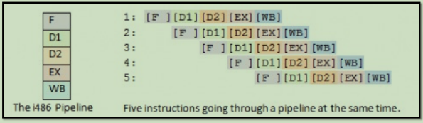
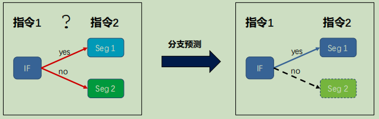
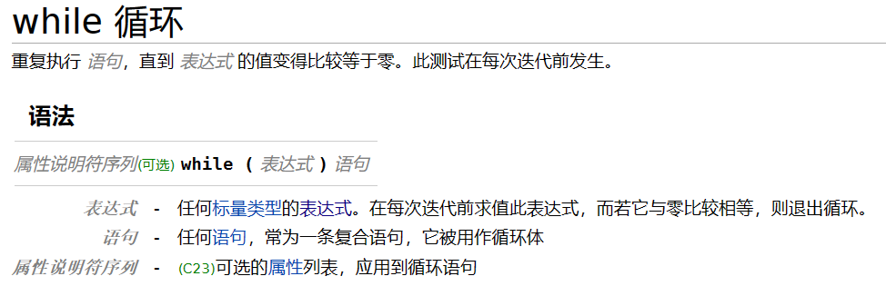
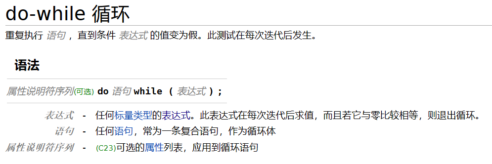
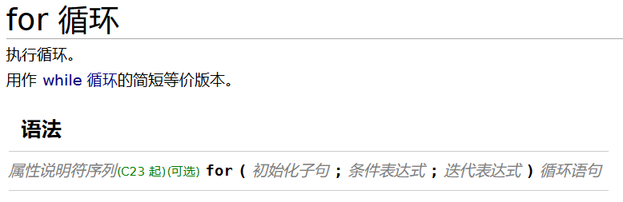
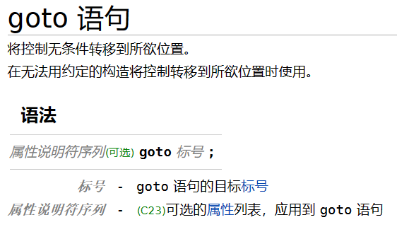

# 第3章 控制流

## 3.1 条件表达式 

|     运算符     |          说明          |
| :-----------: | :-------------------: |
|      ==       |       相等 比较        |
|      !=       |       不等 比较        |
|      <,>      |     小于和大于 比较     |
| <=(=<),=>(>=) | 小于等于和大于等于 比较 |
|       !       |         条件非         |
|      &&       |      逻辑与(并且)      |
|     \|\|      |      逻辑或(或者)      |

1. 由关系运算符所组成的表达式就叫做条件表达式
2. 关系运算符判断两个值或者说两个变量之间关系的
3. 条件表达式：
    - 条件表达式的值只有 **真** 和 **假**
    - 其中 **真** 为 **1**，**假** 为 **0** 
    - <mark>问题1：条件表达式结果 假值0 真值1， 是数值0 1 吗？也就说可以参加计算吗？</mark>
        - <mark>答：是数值0，1可以参与计算。可以通过a += (a == b) 来验证。 </mark>

4. 逻辑与(&&)、逻辑或(||)的短路原则
    - 短路原则：通过前面的表达式就已经可以确定整体表达式的值，就不再计算后面的表达式
    - a < b && printf("YES\n");
    - !(a< b) && printf("NO\n");
    
5. 条件非!：作用是给条件取反。就是说如果原来条件成立取非值条件就为假了；如果原来为假取反就为真了
    
---
## 3.2 分支结构

1. if-else语句



- {}括起来的叫复合语句，组成一条语句

2. switch-case语句


```
switch (a) {
 case v1: 代码块1；
 case v2: 代码块2；
 case v3: 代码块3；
}
case 为条件⼊⼝，程序进⼊ case 所对应的代码段，依次执⾏后续代码，
直到遇到break，或者 switch结构末尾
```

3. cpu的分支预测

```
#define likely(x) __builtin_expect(!!(x), 1)
#define unlikely(x) __builtin_expect(!!(x), 0)
// likely 代表 x 经常成立，加载条件分支内部的代码
// unlikely 代表 x 不经常成立立，加载条件分支外部的代码
```
- 两次逻辑非是为了做逻辑值的归一化
    - !(5) == 0 --> !!(5) == 1
    
- __builtin_expect(!!(x), a)
    - a == 1：告诉cpu，x条件大概率为真
    - a == 0：告诉cpu，x条件大概率为假
    
- cpu的流水线执行操作
    - 程序中每条语句的执行，在cpu内部分为五个步骤：**F(取指令) D1(译码阶段1) D2(译码阶段2) EX(取操作数并执行) WB(写回)**


    - 流水线操作特别讨厌分支结构
    

```__builtin_ffs(x)：返回x中最后一个为1的位是从后向前的第几位
__builtin_popcount(x)：x中1的个数
__builtin_ctz(x)：x末尾0的个数。x=0时结果未定义
__builtin_clz(x)：x前导0的个数。x=0时结果未定义
__builtin_prefetch (const void *addr, ...)：对数据手工预取的方法
__builtin_types_compatible_p(type1, type2)：判断type1和type2是否是相同的数据类型
__builtin_expect (long exp, long c)：用来引导gcc进行条件分支预测
__builtin_constant_p (exp)：判断exp是否在编译时就可以确定其为常量
__builtin_parity(x)：x中1的奇偶性
__builtin_return_address(n)：当前函数的第n级调用者的地址
```

---
## 3.3 循环结构

- while

```
while (表达式) {
 代码块；
}
每当表达式为真时，代码块就会被执⾏1次。
```


- do-while


```
do {
 代码块；
} while (表达式);
每当代码段执⾏1次，就会判断⼀次表达式是否为真。
```

- <mark>ctrl +ｄ(linux) 为文件结束符</mark>

- for



```
for (初始化;循环条件;执⾏后操作) {
代码块；
}

Step1: 初始化
Step2: 循环条件判断
Step3: 执行代码块
Step4: 执行后操作
Step5: 跳转到 Step2
```
- for(; ; ) { printf("for loop\n");};
    - 死循环一直输出for loop
    

- break and continue
    - break
        -  跳出 switch-case 结构
        -  跳出**最近的一层**循环
    - continue
        - 结束**本次循环**，继续下一次循环
        

- goto


```
goto lab_1;
    代码段1;
lab_1:
    代码段2;
    
//跳转到 lab_1 标记初，代码段1被跳过，直接执⾏代码段2

```
- goto语句会跳过相应变量初始化的过程，但不影响变量的存在
- goto模拟if-else语句

```c
#include<stdio.h>

int main() {

    int n;
    scanf("%d", &n);
    n % 2 == 0 && ({goto if_stmt; 1;});
    //()小括号将{}转化成有返回值的表达式，{}将多条语句整成一条复合语句
    //{}的返回值等于最后一条表达式的值
    !(n % 2 == 0) && ({goto else_stmt; 1;});

if_stmt:
    printf("n is even\n");
    goto if_end;
else_stmt:
    printf("n is odd\n");
if_end:
    return 0;
}
//&& 运算符左右两边是可以判断真假的表达式

```

- goto模拟while
   
- goto模拟for


## c语言中的“一条语句”

- 语句有五种类型：
    1. 复合语句         **{ statement; }**
    2. 表达式语句 **expression;**
    3. 选择(分支)语句**if-else**
    4. 循环语句**while/do-while/for**
    5. 跳转语句 **break/continue/return/goto**

