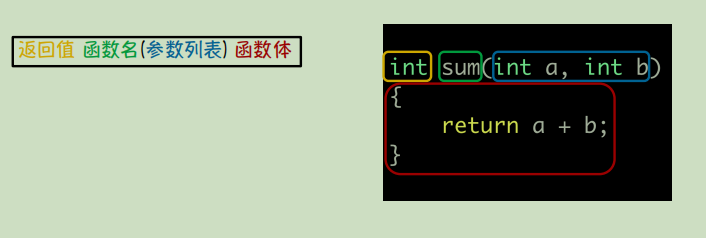
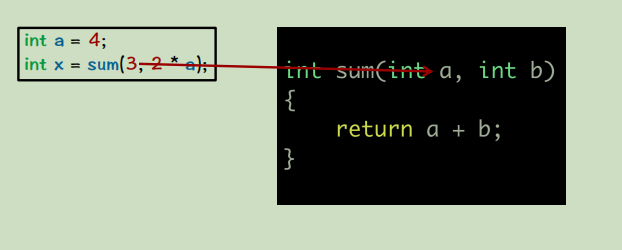
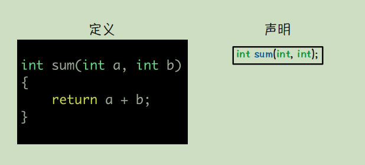
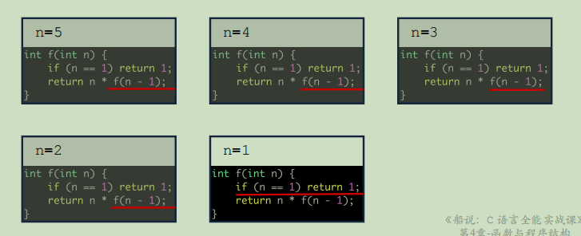
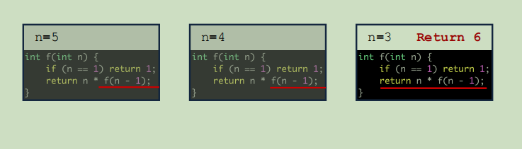
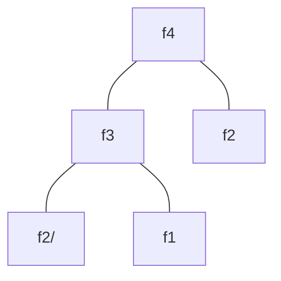
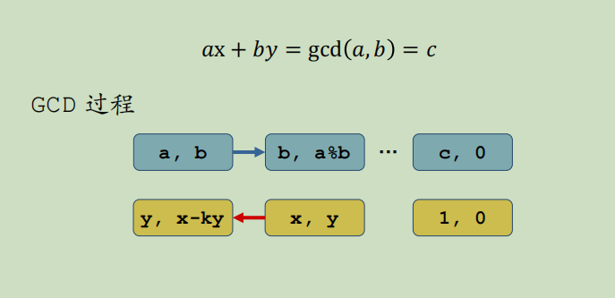
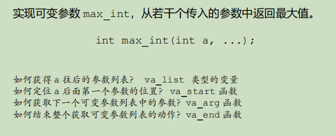

# 第4章 函数与程序结构

## c语言中的函数

**1. 作用域：**<mark>定义的变量，作用的区域</mark>
    - 作用于的三种特性：内作用域，外作用域 
        - {} 里是一个作用域，大作用域可定义多个小作用域
        - 外作用域不可访问内作用域的**一般类型**变量
        - 内可以访问外作用域变量
        - 内的变量名字与外相同，在内部访问该同名变量时，访问的是内部的变量

**2. 函数的基本结构**

 
>Linux gcc 编译器报错  <mark>undefined reference to `pow'</mark>：
>>1. 需要包含头文件<math.h> 
>>2.编译时加 <mark>-lm</mark> 将数学库链接起来

**3. 为什么一定要有函数结构？**
     - 对于程序中具有相似的这种程序功能逻辑的封装
        - 优点：1、程序清晰 2、出错率小
    
**4. 函数中的实参与形参**
    - 形参接受实参的值，实参给形参传值
    - 形参的所有修改，都不会改变实参
    - 函数调用时是按位赋值的


**5. 函数的定义与声明**
    - 声明：函数的说明，在调用一个函数之前要有函数的声明
    - 定义：函数的具体实现    



## 重要的递归函数
   
**1. 递归函数：**自己调用自己的函数
    - 可以用树形结构分析递归

**2. n的阶乘：**
递归向下 ：

递归回溯：


**3. 斐波那契数列**
```c
int f(int n) {
    if(n == 1 || n == 2) return 1;
    return f(n -1) + f(n - 2);
}
```


**4. 欧几里得算法**
>整数 a, b 的最⼤公约数⼀般表示为 gcd(a, b)
>终极奥义：gcd(a, b) = gcd(b, a%b)
>证明1：b和a%b的最⼤公约数，是a和b的公约数
>证明2：b和a%b的最⼤公约数也是a和b的最⼤公约数

- 证明1：
>gcd(b, a%b) = c;
b = x * c;
a % b = y * c  <mark>--></mark> a - k * b = y * c --> a = y * c + k * b <mark>--></mark> a = (y +ｋ＊ｃ) * ｃ
<mark>---></mark> c 是 a 和 b 的公约数
>
- 证明2：

><mark>已知 b = x * c； a = (y +k * x) * c; gcd(x, y) = 1</mark>
反正证明：x 与 (y + k * ｘ) 互质
   $假设x 与 (y + k * ｘ)  不互质$
    $gcd(x, y + k * ｘ) = d;$
    $<mark> x = n * d</mark>; y = - k * x + m * d;$
    $<mark>y = (m - k * n) * d</mark>;$        
    $又因为gcd(x, y) = 1，所以d = 1；得证。$

**5. 递归的奥义**

>**拿起武器：数学归纳法**
>>Step1：验证P(1) 成立
>>Step2：证明如果 P(k) 成立 ，那么P(k+1) 成立
>>Step3：联合Step1 与 Step2，证明由 P(1)->P(n)成立

<mark>**数学归纳法 -- >  结构归纳法**</mark>

>递归函数设计的三个重要的部分
>>1.<font color = red>**重要**</font>：给 递归函数 一个明确的语义
>>2.实现边界条件的程序逻辑  ---> <mark>p(1)</mark>
>>3.假设递归函数调用返回结果正确，实  现本层函数逻辑 ---> <mark>p(k) -->p(k + 1)</mark>

**6. 扩展欧几里得算法**
>贝祖等式：

已知：整数a，b，ab的最大公约数c求一组整数解[x,y]。
由 欧几里得 递归gcd(b, a%b)容易得出最后一组整数解[1,0]；假设上k组解[x, y], 
<mark>**b * x +(a % b) * y  = c --> a * y + b＊(x - k * y)  = c --> [y,  x - k * y] ； k = a / b**</mark>


## 函数的扩展知识

**1. 变参函数**

>va_list数据类型可以存储参数列表
va_start方法可以定位参数列表的第一位参数
va_arg方法可以依次取出参数列表中的参数
va_end方法结束对整个变参列表的处理动作


**2. 主函数的参数**
>**int main();**

>**int main(int argc, char \*argv[]);**
(1) 整形argc：命令行中参数的个数
(2) 字符串数组 argv[]：每个字符串代表命令行中的一个参数


>**int main(int argc, char \*argv[], char **env);**
(1) 整形argc：
(2)字符串数组argv[]：
(3)环境变量env：读取环境变量

## 函数-实战练习
>1.HZOJ-464
 2.HZOJ-465
 3.HZOJ-466
 4.HZOJ-467
 5.HZOJ-468
 6.HZOJ-185
 7.HZOJ-183