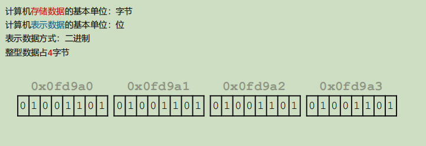
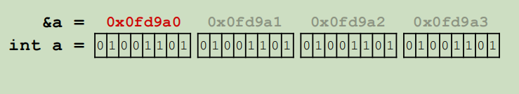
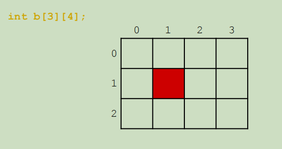
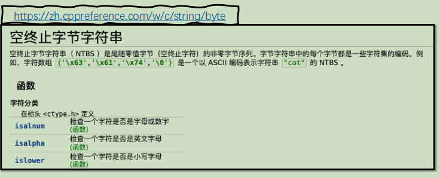
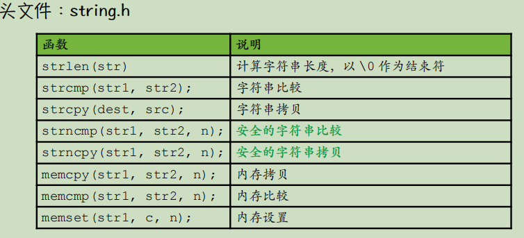
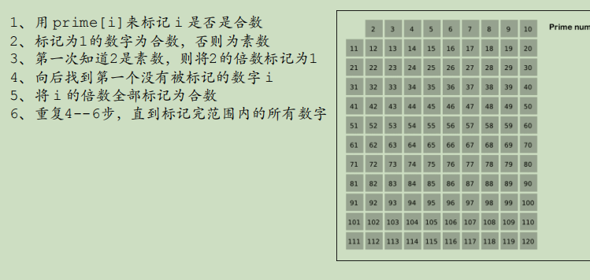
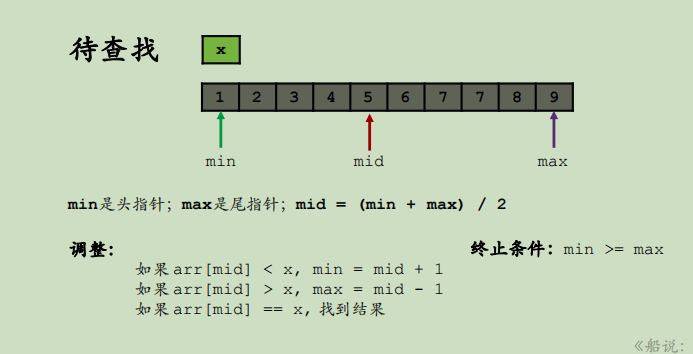
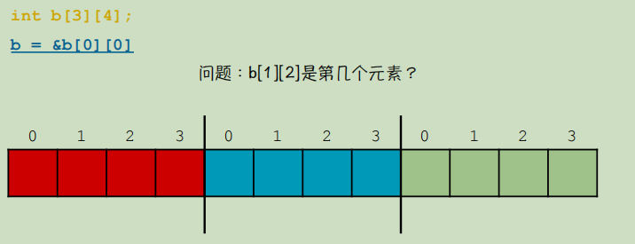
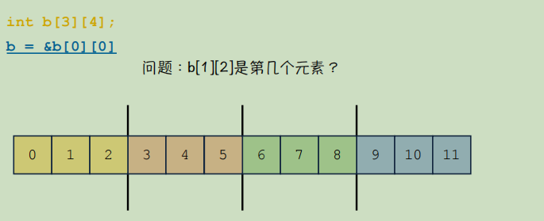

# 第5章 指针与数组

## 5.1 数组
### 5.1.1 必须知道的概念：地址

- 计算机内存中的地址：
    - 船长说概念：地址与字节绑定，每个字节都有一个地址
    - 问：计算机中为啥要有地址这个概念？
        - 答：如把字节当成存放数据的小盒子，地址就是盒子的编号

- 程序中的地址：
    - 变量的地址：整形变量为例，以起始地址为变量的地址

    - 十六进制
        - 符号组成：0-9，A-F
        - 十六进制表示的好处：
            1. 简洁
            2. 方便和二进制转换
            3. **1个**16进制位 等于 **4个**二进制位；一个字节可以用两个**16进制位**表示
            
- 问：地址是一个几位的二进制数据？
    - 答：与操作系统的相关实现有关系
    - 聊聊：32位与64位系统
        - 32位-->2^32^ = 4GB；；32位系统中每个地址用**32位二进制**表示，所以最多有2^32^个地址(也就是最多可以识别4GB内存)
        - 64位-->2^64^ ；；64位系统中每个地址用**64位二进制**表示，所以最多有2^64^个地址
        

### 5.1.2 数组的基本定义与使用

#### 5.1.2.1 数组基本定义

1. **数组的作用**：连续的存储空间，快速定义若干个同类型的数据

2. **不对数组中的值初始化时，数组中的值不确定-----》局部数组在不进行初始化时，它存储的数据是随机的。**
    - 数组数据初始化全为0：int a[5] = {0};//特殊规则，只有{0}才是初始化全为0
    - 对数组中的数据分别初始化：int a[5] = {1, 2, 3, 4, 5};
    - 可变长数组和数组初始化相结合：int a[] = {1, 2, 3 , 4 , 5}; // sizeof(a) / sizeof(int) 获得数组的长度<mark>(数组a占用的总字节 / int整型的占用的字节大小 = 数组中包含几个整型变量)</mark>
    - 数组名字是数组的首地址，数组的首地址是数组下标为0的元素的地址
    
3. **多维数组的定义和使用**

4. 字符数组及操作

- 空终止字节‘\0’
- 字符数组：char str[size];
    - 初始化：
        char str[] = "hello world";
        char str[size] = {'h', 'e', 'l', 'l', 'o'};            
- 字符串的基本操作：
       

- <mark>memset(str1, c, n) : 将str1的每位字节赋值为c</mark>

#### 5.1.2.2 数组的使用

>**数组在程序设计中不可替代的作用**：
>1.素数筛算法
>2.二分查找算法

1. **素数筛算法**
• (1)、标记一个范围内的数字是否是合数，没有被标记的则为素数
• (2)、算法的空间复杂度为 O(N)，时间复杂度为 O(N * loglogN)
• (3)、总体思想是用素数去标记掉不是素数的数字，例如我知道了 i 是素数，那么2\*i、3\*i、4\*i……就都不是素数

        
2. **二分查找算法**

### 5.1.3 数组的存储方式

- 行序优先：

    - 答：b[1][2]   -->  1 * 4 + 2  = 6 

- 列序优先： 

    - 答：b[1][2]  --> 2 * ３ +１ = 7
    

### 5.1.4 数组-课后实战题
>1.HZOJ-144
>2.HZOJ-145
>3.HZOJ-146
>4.HZOJ-147
>5.HZOJ-148
>6.HZOJ-149
>7.HZOJ-150
>8.HZOJ-828

---
---

## 5.2 指针
### 5.2.1 指针变量 也是 变量

### 5.2.2 地址的操作与取值规则

### 5.2.3 重要：指针的集中等价形式

### 5.2.4 数组指针与函数指针

### 5.2.5 常用：内存管理方法

### 5.2.6 指针学习技巧总结

### 5.2.7 指针-课后实战题