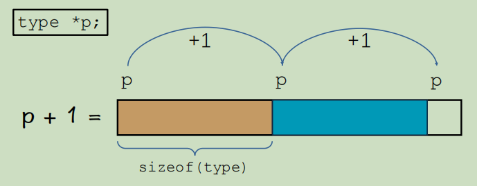

# 第5章 指针与数组

## 5.1 数组
### 5.1.1 必须知道的概念：地址


- 计算机内存中的地址：
    - 船长说概念：地址与字节绑定，每个字节都有一个地址
    - 问：计算机中为啥要有地址这个概念？
        - 答：如把字节当成存放数据的小盒子，地址就是盒子的编号

- 程序中的地址：
    - 变量的地址：整形变量为例，以起始地址为变量的地址

    - 十六进制
        - 符号组成：0-9，A-F
        - 十六进制表示的好处：
            1. 简洁
            2. 方便和二进制转换
            3. **1个**16进制位 等于 **4个**二进制位；一个字节可以用两个**16进制位**表示
            
- 问：地址是一个几位的二进制数据？
    - 答：与操作系统的相关实现有关系
    - 聊聊：32位与64位系统
        - 32位-->2^32^ = 4GB；；32位系统中每个地址用**32位二进制**表示，所以最多有2^32^个地址(也就是最多可以识别4GB内存)
        - 64位-->2^64^ ；；64位系统中每个地址用**64位二进制**表示，所以最多有2^64^个地址
        

### 5.1.2 数组的基本定义与使用

#### 5.1.2.1 数组基本定义

1. **数组的作用**：连续的存储空间，快速定义若干个同类型的数据

2. **不对数组中的值初始化时，数组中的值不确定-----》局部数组在不进行初始化时，它存储的数据是随机的。**
    - 数组数据初始化全为0：int a[5] = {0};//特殊规则，只有{0}才是初始化全为0
    - 对数组中的数据分别初始化：int a[5] = {1, 2, 3, 4, 5};
    - 可变长数组和数组初始化相结合：int a[] = {1, 2, 3 , 4 , 5}; // sizeof(a) / sizeof(int) 获得数组的长度<mark>(数组a占用的总字节 / int整型的占用的字节大小 = 数组中包含几个整型变量)</mark>
    - 数组名字是数组的首地址，数组的首地址是数组下标为0的元素的地址
    
3. **多维数组的定义和使用**


4. 字符数组及操作


- 空终止字节‘\0’
- 字符数组：char str[size];
    - 初始化：
        char str[] = "hello world";
        char str[size] = {'h', 'e', 'l', 'l', 'o'};            
- 字符串的基本操作：
       

- <mark>memset(str1, c, n) : 将str1的每位字节赋值为c</mark>

#### 5.1.2.2 数组的使用

>**数组在程序设计中不可替代的作用**：
><font color = red>1.素数筛算法</font>
><font color = blue>2.二分查找算法</font>

1. **素数筛算法**
• (1)、标记一个范围内的数字是否是合数，没有被标记的则为素数
• (2)、算法的空间复杂度为 O(N)，时间复杂度为 O(N * loglogN)
• (3)、总体思想是用素数去标记掉不是素数的数字，例如我知道了 i 是素数，那么2\*i、3\*i、4\*i……就都不是素数

        
2. **二分查找算法**


### 5.1.3 数组的存储方式

- 行序优先：

    - 答：b[1][2]   -->  1 * 4 + 2  = 6 

- 列序优先： 

    - 答：b[1][2]  --> 2 * ３ +１ = 7
    

### 5.1.4 数组-课后实战题
>1.HZOJ-144
>2.HZOJ-145
>3.HZOJ-146
>4.HZOJ-147
>5.HZOJ-148
>6.HZOJ-149
>7.HZOJ-150
>8.HZOJ-828

---
---

## 5.2 指针
### 5.2.1 指针变量 也是 变量

#### 5.2.1.1 **"指针变量也是变量"**

><font color = red>**核心法门：指针变量也是变量**</font>
>类比：整型变量存放整型值，浮点型变量存放浮点型值；那么指针变量存放的是指针值，指针值是变量的地址。
>><mark>综上：**指针变量也是变量**，该变量存放的是**地址**这种值的。</mark>


>**int \*p = &a  --> p是指针变量，是存放int型a地址的指针变量。**

>>**<mark>问：</mark>指针变量 占几个字节？**
>>**<mark>答：</mark>指针变量存放的是地址，地址是用来存放数据字节的编号，所以指针变量在32位系统下占4字节，在64位系统下占8字节。**

> <mark>int a = 10 ; int *p = &a ;  printf("%d\n", \*p); // \*取值运算符，取到了指针中所存储地址里面所存储的值。</mark> 

#### 5.2.1.2 **函数传递指针变量的场景和用途**
>详情请看第五章代码练习20.function_with_pointer.c

- 想改变实参值的时候传实参的地址进去

- 传出参数
例如：scnaf()函数


- 接受数组参数
    - p[i] <==> *(p+i) ; <mark>[]是运算符,只要是运算符就有等价表示形式</mark>

>例题：HZOJ-881-交换指针变量
>**^ 运算(相同得0，不同得1)有个bug ，swap(&a, &a)同一个变量值交换时会出错；稳妥方法时定义一个临时变量temp。**


### 5.2.2 地址的操作与取值规则

#### 5.2.2.1 **深入理解 <font color=red>p + 1</font>  操作**

>**<mark>重点在指针所指向的类型究竟是什么</mark>**

- **<mark>p + 1 : 是说p存储的地址加1，即地址加了sizeof(type)。</mark>**



- <mark>p[i] <==> *(p + ｉ) <==>arr[i]</mark>
    

    
    
- **<mark>int (*p)[10] : (\*p)是指针，去掉(\*p)剩下的部分是它所指向的类型； int [10]是一个10个整型元素；；所以当前指针p指向的是10个整型元素的指针，也就是说p ＋ 1, 一次性跳过10个整型变量（跳了10 \* sizeof(int)个字节）</mark>**。
```c
    int (*p)[10];
    int arr2[30][10];
    p = arr2;
    //p可以指向一个二维数组，因为两者的地址访问规则是一样的
```       

- **<mark>int *p[10] : p 是一个数组，数组大小是10位，每一位存放一个(int\*)整型地址。------> int \*p[10] 相当于定义了10个整型指针变量。</mark>**

- **<mark>int \*(\*p[10])[20] : \*p[10]是一个指针数组，相当于说定义了10个指针；剩下的部分(int \* [20])，是\*p[10]存放的类型，int \* [20] --> 20个整型元素地址，，每一个指针存放20个整型元素地址。</mark>**
    


#### 5.2.2.2 **深度理解  <font color=red>\*p  </font>（取数据）操作**

>**<mark>重点在指针所指向类型究竟是什么</mark>**

>>**<mark>指针在取值时是按照指针所指向数据类型<font color=red>所占的字节数</font>来取值的，与内存中存储的数据类型无关。(*例如：int \*p 一次取4个字节的数据； double \*p 一次取8字节的数......*)</mark>**


```c
#include<stdio.h>

int main() {
    int n = 0x61626364;//4字节
    char *p = (char *)&n;//指针p指向char类型，（p + 1）跳一个字节
    printf("*(p + 0) = %c\n", *(p + 0));//p取得是n第一个字节的值d
    printf("*(p + 1) = %c\n", *(p + 1));//p取得是n第二个字节的值c
    printf("*(p + 2) = %c\n", *(p + 2));
    printf("*(p + 3) = %c\n", *(p + 3));
    printf("p[0] = %c\n", p[0]);
    printf("p[1] = %c\n", p[1]);
    printf("p[2] = %c\n", p[2]);
    printf("p[3] = %c\n", p[3]);
    return 0;
}
//**大段系统：数字的低位，存储在内存的高位；**
//**小端系统：数字的低位，存储在内存的低位；**
```
- 随堂练习1：Ip 地址一般是由 4 个不超过 255 的数字组成，例如：192.168.1.1
实现一个程序，读入 ip 地址，转换成一个32位整数。<mark>要求：不要使用数学运算符</mark>

```c
#include<stdio.h>

int main() {
    int a, b, c, d;
    scanf("%d.%d.%d.%d", &a, &b, &c, &d);
    unsigned int n;
    char *p = (char *)&n;
    p[3] = a;
    p[2] = b;
    p[1] = c;
    p[0] = d;
    printf("n = %u\n", n);
    return 0;
}
```


### 5.2.3 重要：指针的集中等价形式

```c
#include<stdio.h>

int main() {
    int arr[] = {0, 1, 2, 3, 4, 5, 6};
    int *p = arr;
    for (int i = 0; i < 3; i++) {
        printf("%d\n", (i + 5)[&p[1] - 2]);
    }
    return 0;
}
```


> 示例： p[i] <==> *(p + i) ; [] 是运算符
> 第一步：&p[1] - 2  <==> p + 1 - 2; 
> 第二步：(i +５)[p - 1] <==>  \*(i +５＋ p - 1) == \*(p + ｉ＋４);
>> <mark>分析第二步：由示例可以将"(i+5)"看成p，"p-1"看成i；</mark>
> 第三步：\*(p + ｉ＋ ４) <==> p[i +４]；


### 5.2.4 数组指针与函数指针

### 5.2.5 常用：内存管理方法

### 5.2.6 指针学习技巧总结

### 5.2.7 指针-课后实战题