# 第6章 预处理命令与结构体
>**<mark>船长语录6_1：从本章开始，需要留意环境差异对于我们程序设计所引起的不同。</mark>**

## 6.1 预处理命令
>**<mark>船长语录6_2：预处理命令总的来说是借助编译器的力量来帮助我们写程序。</mark>**
### 6.1.1 重新认识程序的 "编译" 过程
1. **编译过程**

| 文件名后缀 |             说明             | gcc参数 |
| :--------: | :--------------------------: | :-----: |
|     .c     |            源文件            |   无    |
|     .i     |        预处理后的C文件        |   -E    |
|     .s     | 编译之后得到的汇编语言的源文件 |   -S    |
|     .o     |     汇编后得到的二进制文件     |   -c    |


>**<mark>船长语录6_3：编译（船长说的是这三个过程：预处理、编译和汇编）过程是将源文件变成二进制的目标文件；链接阶段是目标文件变成可执行程序。</mark>**


2. **编译和链接阶段究竟在干嘛？**
    - **编译：检查是否有语法错误【检查声明】**
        - *语法格式类错误*
        - *使用了未声明的标识符*
    - **链接：检查是否有定义缺失(少了)或冲突(一个定义出现了多次)【检查定义】**
     
>**<mark>船长语录6_4：只要我们的代码没有语法错误，就能通过编译阶段（链接成功否未知）生成目标文件。</mark>**
>**<mark>船长语录6_5：对象文件（即目标文件）中存着定义----命令：nm -C 对象文件；可查看。</mark>**
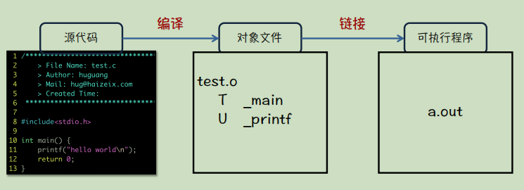
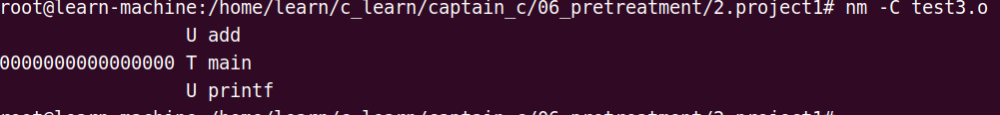
>><mark>上图说明目标文件test.o相关的函数或者标识符的定义共有三个。</mark>
>>**T：相应函数的定义是存储在当前对象文件中的；**
>>**U：在链接时会到外部去查找相关定义；printf函数定义是在系统库里面。**

3. 聊聊：声明和定义
    - 函数的声明和定义 
    - 变量的声明和定义

```c
//decl_def.c
#include<stdio.h>
 
int add(int, int); //函数声明

extern int c, d; //在main外部声明变量

 int main() {
    int a = 1, b = 2;//在main函数里的是定义变量
     printf("a + b + c + d = %d\n", a + b + c + d);
     return 0;
 }

//函数定义
 int add(int a, int b){
     
     return a + b;
 }
 
//def_c_d.c
#include<stdio.h>

int c = 3, d = 4; //定义变量

```
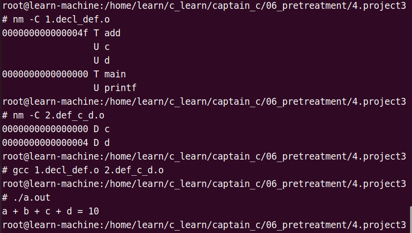

### 6.1.2 认识：预处理命令家族
    
- **预处理命令家族的姓氏：#**
    - 在编译之前还有一个预处理阶段；
    - 待编译原码本质还是代码；
    - **编译阶段检查语法错误，检查的是待编译源码的错误；**


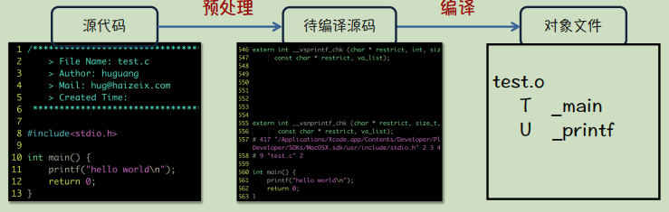

>**<mark>船长语录6_6：预处理阶段处理的是源代码中的预处理命令（预处理家族中的成员就是作用在预处理阶段的）；预处理之后的"待编译原码"就没有了预处理家族中身影了。</mark>**

- **#include 的工作原理：**
    -**#include 做的事情就是 “粘贴”；**
    - **<> ：默认查找路径**
    - **" "：当前目录下**
    - **添加默认路径的方法：1. gcc -I/. test.c；**
    - **#include：可以包含任意类型的文件；因为在C语言中文件的后缀名没有任何作用，只是起到加以区分；**
    - **在工程开发中.h头文件放声明，.c源文件放定义，这样做可以解决由于include所引起的编译链接错误；**
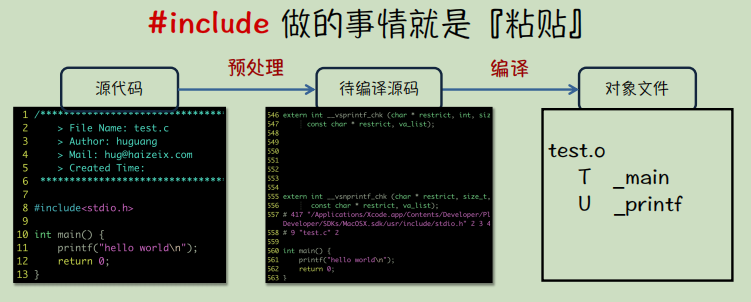


### 6.1.3 必知必会：宏定义

>**<mark>船长语录6_7：学会宏定义是一项让编译器帮我们写代码的技能。</mark>**

>**<mark>#define 做的事情就是<font color = red>简单的</font>"替换"</mark>**
>**<mark>#include 做的事情就是"粘贴"</mark>**

- 自定义宏
```c
//语法规则： #define 标识符 要替换的内容
//定义符号常量：
    #define PI 3.14159265
    #define MAX_N 10000
//定义傻瓜表达式：
    #define MAX(a, b) (a) > (b) ? (a) : (b)
    #define S(a, b) a * b
    //S(int, p); 是可行的，这不同于函数。
//定义代码段：
    #define P(a) { \
        printf("%d\n, a); \
    }
    // "\"续行符，后面啥也不能有，空格也不行。
    //宏 在代码中只占用一行；续行符的作用方便人去看，编译器看来是一行，这不冲突。
```
- 编译器的内置宏

|          宏          |                     说明                      |
| :-----------------: | :------------------------------------------: |
|      __DATE__       |              日期：M mm dd yyyy               |
|      __TIME__       |                时间：hh:mm:ss                 |
|      __LINE__       |                     行号                      |
|      __FILE__       |                    文件名                     |
|      __func__       |      函数名/<font color=red>非标准</font>      |
|      __FUNC__       |      函数名/<font color=red>非标准</font>      |
| __PRETTY_FUNCTION__ | 更详细的函数信息/<font color=red>非标准</font> |
>"<font color=red>非标准</font>"是说，在不同编译器的用法不一致。  

- **宏定义中的 # 和 ## 的作用**

    - \# 叫做字符串化
    - \## 叫做连接

- 随堂练习题：
    - 请实现一个没有 BUG 的 MAX 宏，需要通过如下测试：
        - 1. MAX(2,3)
        - 2. 5 + MAX(2, 3)
        - 3. MAX(2, MAX(3,4))
        - 4. MAX(2, 3 > 4 ? 3 : 4)；**<mark>"? :"表达式“从右到左”结合。</mark>**
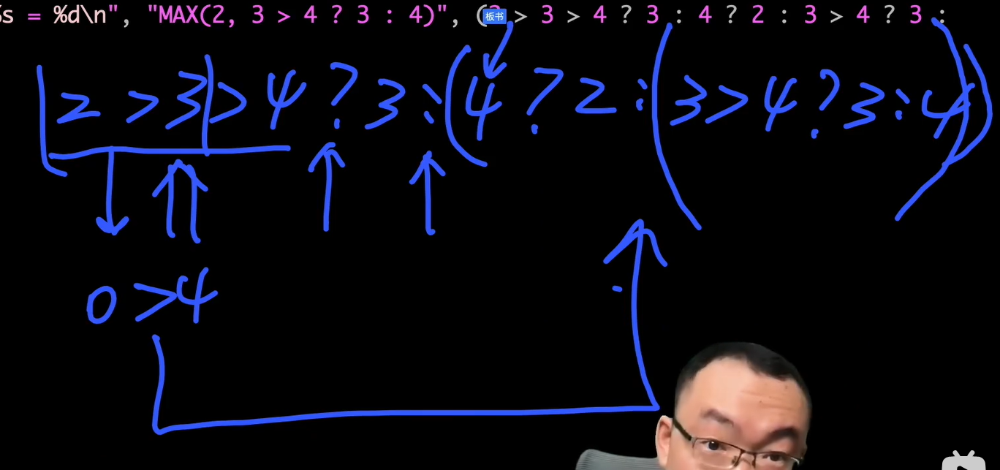
        - 5. MAX(a++, 6) a的初始值7，返回值7，a的值变为8

```c
#include<stdio.h>

#define P(func) { \
    printf("%s = %d\n", #func, func); \
}
/*
#define MAX1(a, b) a > b ? a : b //满足1不满足2
#define MAX1(a, b) （a > b ? a : b）//满足1，2，3不满足4
#define MAX1(a, b) ((a) > (b) ? (a) : (b)) //满足1，2，3，4不满足5
#define MAX1(a, b) ({ \
    int __a = (a), __b = (b); \
    __a > __b ? __a : __b; \
}) //满足12345；加{}是一段语句，加()是将语句变成具有返回值的代码段，返回值 = 代码段最后一行的值
*/
#define MAX(a, b) ({ \
    int __a = (a), __b = (b); \
    __a > __b ? __a : __b; \
})

int main() {
    P(MAX(2, 3));
    P(5 + MAX(2, 3));
    P(MAX(2, MAX(3, 4)));
    P(MAX(2, 3 > 4 ? 3 : 4));
    int a = 7;
    P(MAX(a++, 6));
    printf("after max a = %d\n", a);
    return 0;
}
```
        
### 6.1.4 必知必会：条件编译

>**#include 做的事情就是『粘贴』**
>**#define 做的事情就是『替换』**
>**#if 做的事情就是『选择』**
>**<mark>船长语录6_8：“条件编译”是进行代码剪裁，根据条件是否成立来决定留下那部分代码。并非去执行代码。</mark>**

>>定义宏的方式：
>>>1. 在文件中#define的方式
>>>2. 用 gcc -D 宏名 待编译文件；如：gcc -D DEBUG test.c

|       函数        |          说明          |
| :--------------: | :-------------------: |
|   #ifdef DEBUG   |  是否定义了 DEBUG 宏   |
|  #ifndef DEBUG   |  是否没定义 DEBUG 宏   |
|  #if MAX_N == 5  |   宏 MAX_N 是否等于5   |
| #elif MAX_N == 4 | 否则宏 MAX_N 是否等于4 |
|      #else       |                       |
|      #endif      |                       |

> if()else语句在运行时才起作用，运行环境不同时会出现bug，**然而<font color=red>“条件编译”</font>可以根据运行环境不同选择不同的代码段去运行。**


---

## 6.2 宏定义-课后实战

>1. 带等级的日志打印功能
>2. 统计函数运行时间
>3. 让C函数支持默认参数
>4. “搞笑”写出像摩斯密码一样的程序

- 带等级的日志打印功能
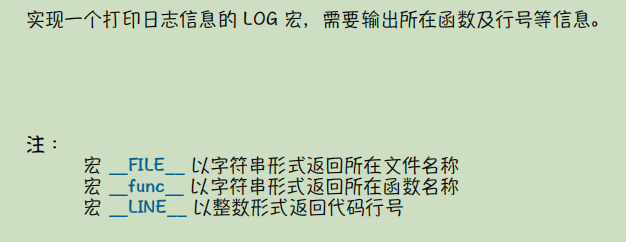
- 统计函数运行时间：实现一个输出函数运行时间的TIME宏
```c
#define TIME(func) { \
    long long b = clock(); \
    func; \
    long long e = clock(); \
    printf("%s run %lldms\n", #func, 1000 * (e - b) / CLOCKS_PER_SEC); \
}
//宏CLOCKS_PER_SEC表示一秒钟有多少时间戳； 1s = 1000ms。
```
- 让C函数支持默认参数：利用宏技巧，让 C 语言函数表现出支持默认参数的特性。
    - c++是支持默认参数的；如：int test(int a = 11,  int b = 12)。

```c
#define D_VAL(a, val) (#a[0] ? a : val)
#define test_func(a, b, c) __test_func(D_VAL(a, 97), D_VAL(b, 111), D_VAL(c, 12.3))
void __test_func(int a, int b, double c) {
    printf("a = %d, b = %d, c = %lf\n", a, b, c);
    return ;
}
```

- “搞笑”写出像摩斯密码一样的程序：如何摧毁你同学的意志，消灭他一切抄你代码作业的欲望。

---

## 6.3 结构体、联合体与枚举类型

### 6.3.1 结构体
>**<mark>船长语录6_9：在c语言中，结构体提供一种方式让我们定义一种复合类型(基于原有的类型，定义更复杂的类型)。</mark>**


```c

#include<stdio.h>

typedef struct person{//省略结构体名字，相当于定义一个匿名结构体类型。
    char name[20];
    int age;
    char gender;
    float height;
}person;

//以指着的形式间接访问
void output(struct person *p) {      
    printf("user point p : (%s, %d, %c, %f)\n",
           p->name, 
           p->age, 
           p->gender, 
           p->height
    );
    return ;
}

//set_buff(数组，结构体首地址，结构体中元素的首地址，结构体中元素的结束地址，标记符)
void set_buff(char *buff, void *head, void *begin, void *end, char ch) {
    
    while (begin != end){
        buff[begin - head] = ch;
        begin += 1;
    }
    return ;
}

//结构体数据类型所占空间大小，和数据元素的分布情况
void output_person() {
    int n = sizeof(struct person);
    char buff[n];
    for (int i = 0; i < n; i++) buff[i] = '.';
    int len = 0;
    for(int i = 0; i < n; i++) {
        len += printf("%3d", i);
    }
    printf("\n");
    for(int i = 0; i < len; i++) printf("-");
    printf("\n");
    struct person hug;
    set_buff(buff, hug.name, hug.name, 20 + (void *)hug.name, 'n');
    set_buff(buff, hug.name, &hug.age, 4 + (void *)&hug.age, 'a');
    set_buff(buff, hug.name, &hug.gender, 1 + (void *)&hug.gender, 'g');
    set_buff(buff, hug.name, &hug.height, 4 + (void *)&hug.height, 'h');
    for(int i = 0; i < n; i++) {
        printf("%3c", buff[i]);
    }
    printf("\n");
    return ;
}


int main() {
    //hug是struct person类型的变量
    struct person hug = {"zhangsan", 18, 'M', 1.80};
    person su = {"Su", 20, 'M', 1.79};
    printf("(%s, %d, %c, %f)\n", hug.name, hug.age, hug.gender, hug.height);//直接访问 "."运算符
    output(&hug);
    output(&su);

    printf("sizeof(struct person):%lu\n", sizeof(struct person));
    output_person();
    return 0;
}
```
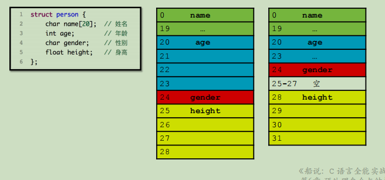

>**<mark>结构体-对齐补齐规则</mark>**
>>1. 类型都有一个对齐值，**内建类型**（c语言中本身就有的类型）的**对齐值**等于其自身大小
>>>**<font color=red>对齐值是看数据类型，不看数组也不看位域</fort>**

>>2. **结构体的对齐值**，等于其成员中的**最大对齐值**

```c
struct A {
    char a; // 1
    short b;// 2
}; // A 对齐值为 2

struct B {
    struct A a; // 2
    struct {
        char b; //1
        double c;//8
    } d; //开辟一个数据字段d 
    // 8
    int e; //4
}; // B 对齐值 8

struct B {
    struct A a;
    struct {
        char b;
        double c;
    }; //在结构体中定义结构体，它不是数据字段
    int d;
};
```

>>3. 成员被存储在其**整数倍的对齐值**位置上；例如：对齐值为4的结构体
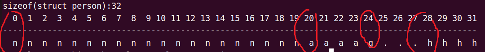

>>4. 可以通过**\#pragma pack**限制对齐值的最大值**（如果对齐值超过了限制值，按照限制值来算，没有超过的话对齐值是几就是几）**

<div align=center>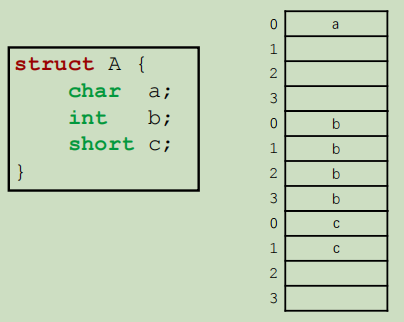</div>
<div align=center>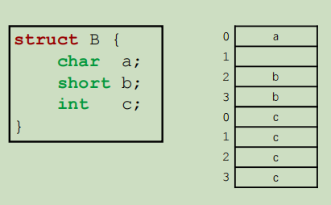</div>
<div align=center></div>
<div align=center>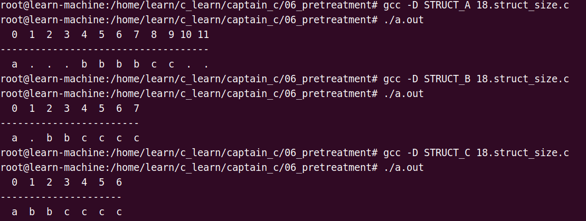</div>


### 6.3.2 联合体
>**<mark>船长语录6_10：联合体中每一个数据字段他们共用存储空间，如果通过一个字段把相应的值给改了，那么通过另外一个字段读出来的值他也会发生变化。</mark>**
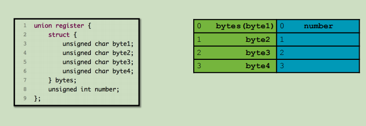
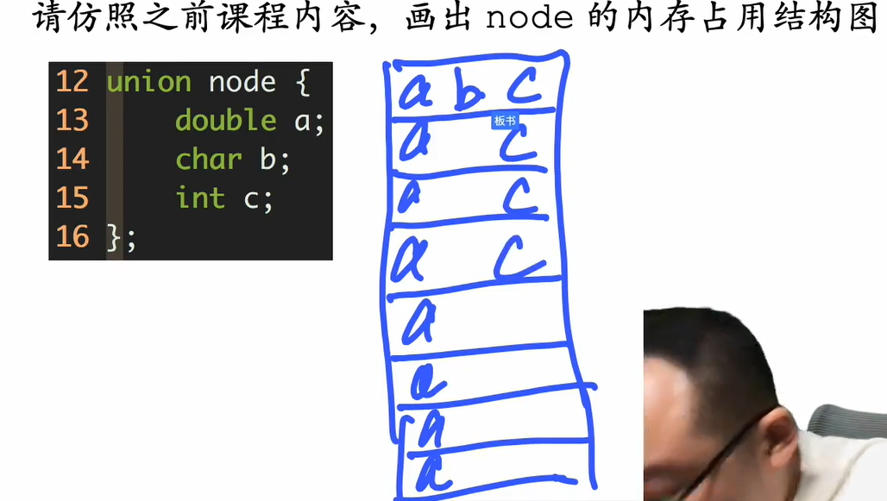


### 6.3.3 枚举类型

- **枚举类型的定义：用枚举类型的"枚举值"表示数值：枚举类型的第一项默认为数值0，下面的依次加1；也可以手动给枚举值设置初始值。**

><mark>船长语录6_11：枚举类型三个用法。</mark>
>>**1. 通过枚举值实现数组的自动扩容；**
>>**2. 增加代码的可读性**
>>**3. 辅助做程序设计**，比如输出彩色文字。
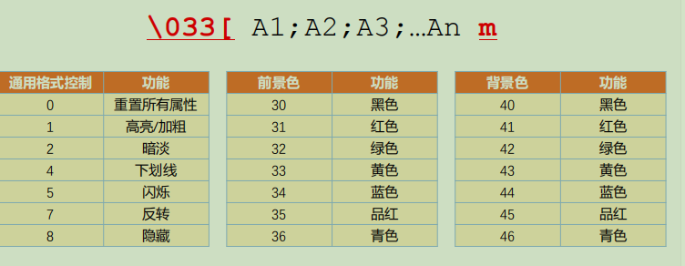

```c
#include<stdio.h>

#ifdef PLAN_A

#define COLOR(msg, code) "\033[1;" #code "m" msg "\033[0m"
#define RED(msg)    COLOR(msg, 31)
#define GREEN(msg)  COLOR(msg, 32)
#define YELLOW(msg) COLOR(msg, 33)
#define BLUE(msg)   COLOR(msg, 34)

int main() {
    printf("\033[1;32;43mhello world\n\033[0m");
    printf(RED("hello color\n"));
    printf(GREEN("hello color\n"));
    printf(YELLOW("hello color\n"));
    printf(BLUE("hello color\n"));
    return 0;
}

#else

enum COLOR_CODE {
    RED = 31,
    GREEN,
    YELLOW,
    BLUE
};

#define COLOR_SET "\033[1;%dm"
#define COLOR_END "\033[0m"

int main() {
    printf(COLOR_SET "hello color plan b\n" COLOR_END, RED);
    printf(COLOR_SET "hello color plan b\n" COLOR_END, GREEN);
    printf(COLOR_SET "hello color plan b\n" COLOR_END, YELLOW);
    printf(COLOR_SET "hello color plan b\n" COLOR_END, BLUE);
    printf(
        COLOR_SET "hello"
        COLOR_SET " color"
        COLOR_SET " plan"
        COLOR_SET " b\n"
        COLOR_END,
        RED, GREEN, YELLOW, BLUE
    );
    return 0;
}
#endif
```

### 6.3.4 位域的概念与使用

```c
#include<stdio.h>

#define P(a, format) { \
    printf("%s = " format "\n", #a, a); \
}

struct A {
    unsigned int a:1; //取一个二进制位
    unsigned int b:2; //取两个二进制位
    unsigned int c:3; //取三个二进制位
};

int main() {
    P(sizeof(struct A), "%lu");
    struct A obj;
    obj.a = 15;
    obj.b = 15;
    obj.c = 13;
    P(obj.a, "%d");
    P(obj.b, "%d");
    P(obj.c, "%d");
    return 0;
}
```

> 有符号整型位域
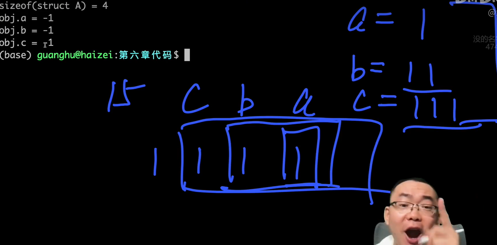


>>随堂练习：使用位域的相关技巧，实现输出整型数字的⼗六进制表示
>>>**注意：不能使用 %x 和 %X 占位符**

---

## 6.4 附加内容：链表

>**<mark>详情请看船说系列算法课程</mark>**

---

## 6.5 实现一种有趣的链表结构

>”将不同类型的数据串成一个链表“
>>**实现这个功能需要一个功能：知道链表字段p的位置反推出相关类型的起始地址**
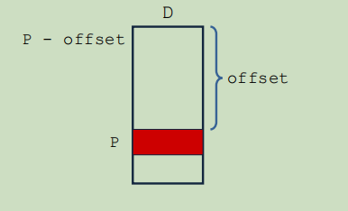

1. 设计一根绳子，将数据绑在上面

2. 从字段地址到结构体首地址

```c
#include<stdio.h>

#ifdef OFFSET1
//方法一：
//T：类型 d：类型中的字段 
//offset：数据类型的字段地址与类型的起始地址的偏移量
//这个方法在计算偏移量时额外开辟了一个数据变量，对空间有点浪费
#define offset(T, d) ({ \
    T t; \
    (void *)(&t.d) - (void *)(&t);})    
#else

//编程技巧：整个系统中一定有一个地址为0->NULL；如果我们从0号地址开始
//开辟一个数据变量，那末相应字段所存储的位置就是我们要的偏移量。
#define offset(T, d) ((size_t)(&(((T *)(0))->d)))

//知道字段地址反推出数据类型的首地址[&d-offset]
//addr：字段的地址  T：类型 d：字段的名称
#define start(addr, T, d) ((T *)(((void *)addr) - offset(T, d)))

#endif

struct A {
    int a;
    char b;
    double c;
};

int main() {
    printf("offset(A, a) = %lu\n", offset(struct A, a));
    printf("offset(A, b) = %lu\n", offset(struct A, b));
    printf("offset(A, c) = %lu\n", offset(struct A, c));

    struct A a;
    printf("&a = %p\n", &a);
    printf("strat(&a.a, A, a) = %p\n", start(&a.a, struct A, a));
    printf("strat(&a.b, A, b) = %p\n", start(&a.b, struct A, b));
    printf("strat(&a.c, A, c) = %p\n", start(&a.c, struct A, c));

    return 0;
}

```
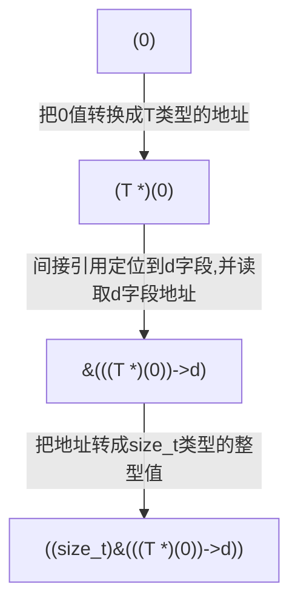


3. 梦想照进现实，实现有趣的链表结构

```c
#include<stdio.h>
#include<stdio.h>
#include<stdlib.h>

//编程技巧：整个系统中一定有一个地址为0->NULL；如果我们从0号地址开始
//开辟一个数据变量，那末相应字段所存储的位置就是我们要的偏移量。
#define offset(T, d) ((size_t)(&(((T *)(0))->d)))

//知道字段地址反推出数据类型的首地址[&d-offset]
//addr：字段的地址  T：类型 d：字段的名称
#define start(addr, T, d) ((T *)(((void *)addr) - offset(T, d)))


enum DataType {
    A_Type,
    B_Type,
    C_Type,
    MAX_Type
};

typedef struct Link {
    enum DataType type;
    struct Link *next;
}Link;

struct A {
    int x, y;
    Link l;
};

Link *getDataA() {
    struct A *a = (struct A *)malloc(sizeof(struct A));
    a->x = 3, a->y = 4;
    a->l.next = NULL;
    a->l.type = A_Type;
    return &(a->l);
}

void output_A(Link *p) {
    struct A *a = start(p, struct A, l);
    printf("struct A : x = %d, y = %d\n", a->x, a->y);
    return ;
}

struct B {
    int a;
    Link l;
    double b;
};

Link *getDataB() {
    struct B *b = (struct B *)malloc(sizeof(struct B));
    b->a = 100, b->b = 45.3;
    b->l.next = NULL;
    b->l.type = B_Type;
    return &(b->l);
}

void output_B(Link *p) {
    struct B *b = start(p, struct B, l);
    printf("struct B : a = %d, b = %lf\n", b->a, b->b);
    return ;
}

struct C {
    char c;
    Link l;
    const char *s;
    int t;
};

Link *getDataC() {
    struct C *c = (struct C *)malloc(sizeof(struct C));
    c->c = 'x', c->s = "struct C", c->t = 99;
    c->l.next = NULL;
    c->l.type = C_Type;
    return &(c->l);
}

void output_C(Link *p) {
    struct C *c = start(p, struct C, l);
    printf("struct C : c = %c, s = %s, t = %d\n", c->c, c->s, c->t);
    return ;
}

int main() {
    #define MAX_OP 10
    Link head, *p = &head;
    for (int i = 0; i < MAX_OP; i++) {
        switch (rand() % 3) {
            case 0: p->next = getDataA(); break;
            case 1: p->next = getDataB(); break;
            case 2: p->next = getDataC(); break;
        }
        p = p->next;
    }
    for (p = head.next; p; p = p->next) {
        switch (p->type) {
            case A_Type: output_A(p); break;
            case B_Type: output_B(p); break;
            case C_Type: output_C(p); break;
            default : break;
        }
    }

    return 0;
}
```