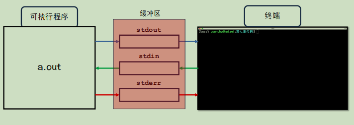

[toc]

# 第7章 重学输入输出

## 7.1 程序中的标准流

### 7.1.1 三个标准流

>**标准输出流<mark>(stdout：0)</mark>**

>**标准输入流<mark>(stdin：1)</mark>在终端里面敲回车时，要输入的内容才会进到输入缓冲区；**

>**标准错误输出流<mark>(stderr：2)</mark>**



### 7.1.2 窥探标准流的工具：fscanf和fprintf

>**<mark>船长语录7_1：fcanf和fprintf可以显示操作三个标准流；' f '代表操作文件的意思。</mark>**

```c

int fprintf( FILE          *stream, const char          *format, ... );

int fprintf( FILE *restrict stream, const char *restrict format, ... );

//
int fscanf( FILE          *stream, const char          *format, ... );

int fscanf( FILE *restrict stream, const char *restrict format, ... );
```
- fscanf
- fprintf


### 7.1.3 标准流的重定向

> 1. **使用freopen重定向**
```c
    FILE *freopen( const char *filename, const char *mode,
               FILE *stream );
//filename	-	要关联到文件流的文件名
//mode	-	确定文件访问模式的空终止字符串
//stream	-	要修改的文件流
```
> 2. **在命令行中重定向**
>> ">" : 从a.out向文件中输入数据
>> "<" : 从文件中读入数据给a.out
>>"0" ;"1"; "2";
>>>**从一个终端重定向到另外一个终端**
<mark>(命令：tty)</mark>

---

## 7.2 重学scanf函数


### 7.2.1 scanf函数的读入缓冲区

### 7.2.2 重新理解：scanf读入%c

>%c读入缓冲区中的当前字符。

### 7.2.3 处理scanf读入残值的技巧

- 处理scanf的残值问题
>getchar：吞掉当前字符
>fflush：冲掉缓冲区中的值（有缺陷）

---

## 7.3 实现一个printf函数

1. 第一步：实现printf函数的声明形式

2. 第二步：实现输出 hello world 功能

3.  第三步：实现%s输出功能

4.  第四步：实现%d输出功能

5.  第五步：实现%x输出功能