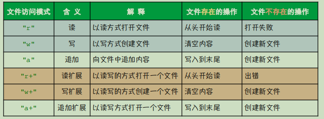

# 第8章 文件操作

## 8.1 基础夯实

### 8.1.1 将数据放进文件里
1. 初识程序中的文件类型
    - FILE *fp（文件指针类型变量）可以指向一个文件
    - 功能函数fopen(要打开的文件名, 要打开的文件的模式)
    - 功能函数fclose：int fclose( FILE *stream );   在不用该文件时关闭文件，避免误操作。
    - fprintf(FILE          \*stream, const char          \*format, ...);
    
```c
FILE *fopen( const char *filename, const char *mode );
FILE *fopen( const char *restrict filename, const char *restrict mode );
//filename	-	关联到文件系统的文件名
//mode	-	确定访问模式的空终止字符串文件访问模式
//streamptr	-	指向存储函数结果的指针的指针（输出参数）
```

 
2. 详解：文件打开模式



3. 读写文件方法与技巧
- 三个函数
    - 将数据写入文件中
    - 从文件读取数据
    - 清空文件内容

4. 子项目1：学生信息管理系统

- 学生管理系统的交互界面
- 学生列表的打印功能
- 添加学生
- 修改信息
- 删除学生


### 8.1.2 实现单条数据的修改

### 8.1.3 实现数据的二进制存储

---

## 8.2 项目开发

### 8.2.1 实现用户交互流程

### 8.2.2 实现多表的注册功能

### 8.2.3 实现数据的增删改查

---

## 8.3 项目测试

### 8.3.1 增加多表功能测试

### 8.3.2 交互流程功能测试

### 8.3.4 切换多表功能测试
 